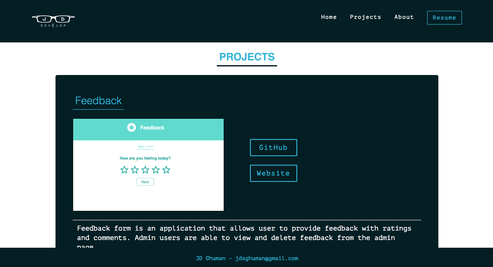
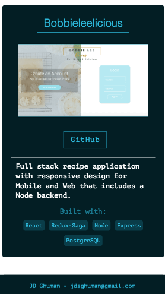

# Portfolio - React with Redux Saga

## Local Setup

```
npm install 
```
Not that the dependencies are installed, start the react client app.

```
npm run client
```

## Screenshots

### Home - Desktop


### Home - Mobile


View 2


### Projects Page - Desktop


### Projects Page - Mobile


View 2




