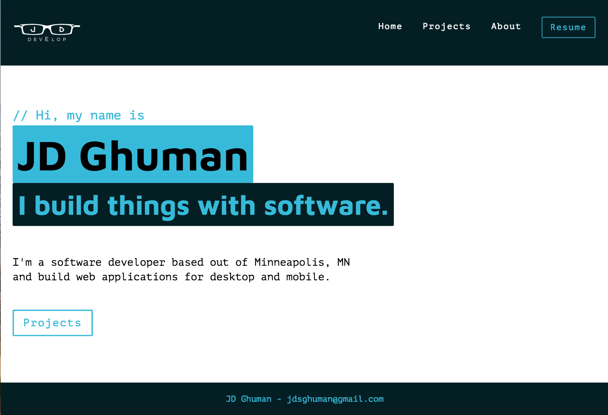
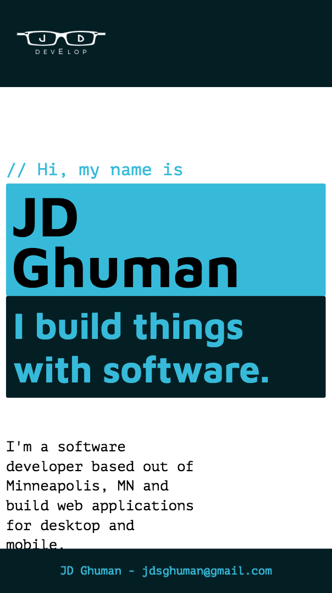
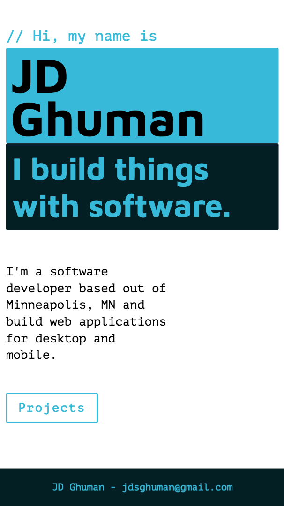

# Portfolio - React with Redux Saga

## Local Setup

Create your database and tables using the provided database.sql file. Start the server.

```
npm install 
npm run server
```
Now that the server is running, open a new terminal tab with cmd + t and start the react client app.

```
npm run client
```

## Feature List

### Project Page

- [ ] Client side route that displays projects that are stored in the database
- [ ] Each project should conditionally render a name, description, thumbnail, website, date complete and a tag. Many of the fields are optional, only show properties that aren't null.
- [ ] Include a link to GitHub that opens in a new window
- [ ] Use Sagas for API requests to your server

### Admin Page

- [ ] Client side route that displays a form allowing you to add a new project to the portfolio
- [ ] Drop down menu with a list of tags
- [ ] Send data to the server and notify the user of success or failure
- [ ] List projects by name and allow the user to delete them
- [ ] Include a button that navigates to the project page

## Screenshots

### Home - Desktop


### Home - Mobile



### Projects Page - Desktop


### Projects Page - Mobile


